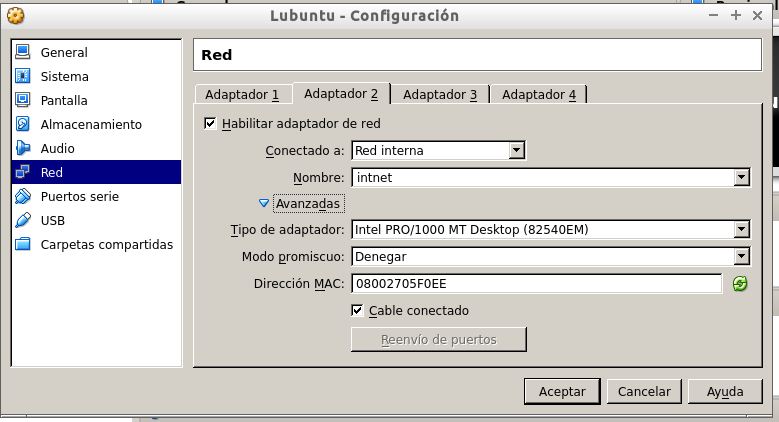
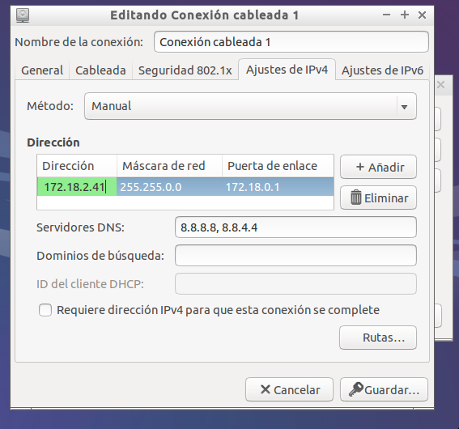
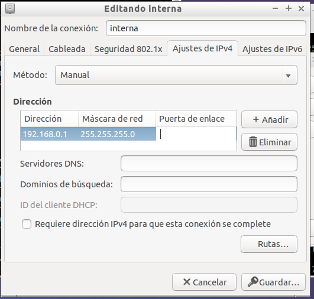
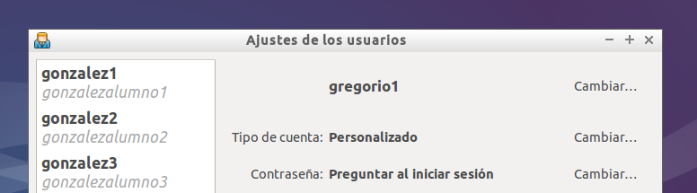
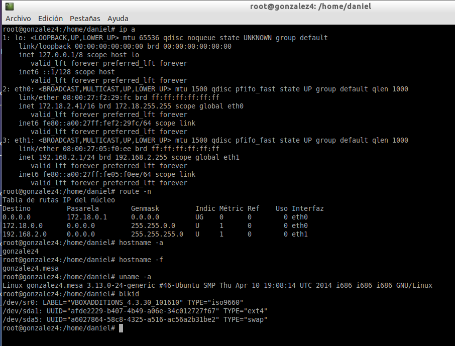
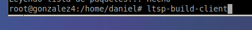
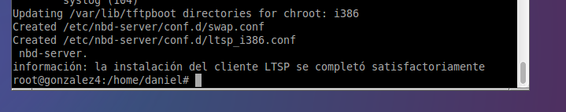
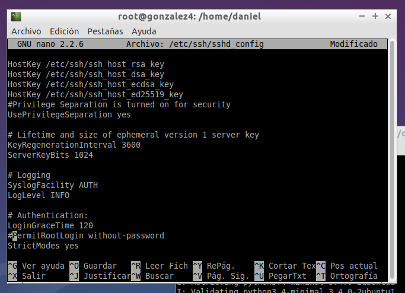
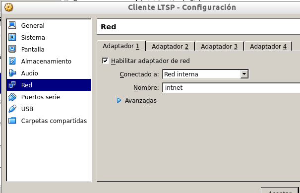

## A2: Clientes ligeros ##

Antes de iniciar la máquina server le he agregado una segunda tarjeta de red en modo interna, esta será la que utilice para conectase con los clientes.

Ahora le asigno una IP estática a la tarjeta de red principal del servidor y a la segunda tarjeta que será la interna.

Aquí estoy creando los usuarios que posteriormente se conectaran al servidor desde un cliente utilizando la imagen creada.

Comprobación de los comandos solicitados.

Para comenzar la instalación del servidor ltsp utilizo el siguiente comando.

Para crear la imagen que utilizaran los clientes

Comprobación de que la imagen se ha creado perfectamente.

Edito el fichero SSh.conf para permitir la conexión con el profesor a la máquina servidor.

Una vez tengo la imagen creada procedo a configurar una máquina cliente donde el adaptador de red lo pondré en modo interno y en las opciones de arranque como principal la tarjeta de red.

En el siguiente enlace se puede ver como con las dos maquina iniciadas y utilizando uno de los usuarios creados se conecta perfectamente.
[Funcionamiento cliente LTSP](https://www.youtube.com/watch?v=lKsThv2gAAM)
