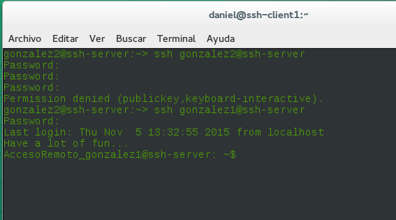
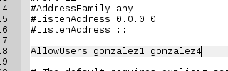

## A5: Acceso remoto SSH ##
El primer paso para hacer esta práctica ha sido configurar las tarjetas de red de las máquinas,**server(ssh-server),cliente1(ssh-cliente1),cliente2(ssh-cliente2)**.

En esta captura muestro la configuración de la máquina servidor utilizando yast.

En esta captura muestro la configuración de la máquina cliente 1 utilizando yast.

En esta captura muestro la configuración de la máquina cliente 2.
le e asignado la dirección IP **172.18.2.13**

En el archivo host he añadido los equipos con su respectiva IP, así podremos encontrarlos por sus nombres.

Comprobación con los comandos descritos en la práctica.

En el servidor he creado 4 usuarios con yast.Estos usuarios los usare para conectarme por medio de ssh desde un cliente al servidor

### Instalación del servicio SSH ###
He descargado he instalado el servicio SSH con la ayuda de yast.

En esta captura muestro como el servicio SSH está en ejecución con el comando "systemctl status sshd".

En mi caso he tenido que añadir una excepción en el cortafuegos para permitir el servicio SSH.

Ahora desde la máquina cliente 1 voy a conectarme con ssh utilizando uno de los usuarios anteriormente creados en este caso utilizare a "gonzalez1".Para realizar la conexión usaré el siguiente comando "ssh gonzalez1@ssh-server".

En esta captura podemos ver el intercambio de claves que se produce en el primer proceso de conexión SSH.

Contenido del fichero $HOME/.ssh/known_hosts en el equipo ssh-client1

En esta captura estoy modificando el fichero  etc/ssh/sshd_config para descomentar la línea HostKey /etc/ssh/ssh_host_rsa_key

Ahora voy a genrerar nuevas claves en el servidor ejecutando como root el siguiente comando:
ssh-keygen -t rsa -f /etc/ssh/ssh_host_rsa_key

Una vez genero las claves nuevas me aparece un aviso, el cliente que detecta que la clave del servidor ha cambiado.

### Personalización del prompt Bash ##

En esta captura estoy modificando el fichero .bashrc del usuario gonzalez1,este fichero se encuentra en /home/gonzalez1/.bashrc

He creado el fichero .alias como se pide en la práctica.

Ahora al conectar con gonzalez1 desde la máquina cliente tendrá un aspecto diferente que se podrá apreciar en las capturas más adelante.

### Autenticación mediante claves públicas ###

Ejecutamos ssh-keygen -t rsa para generar un nuevo par de claves.

Ahora vamos a copiar la clave pública (id_rsa.pub) del usuario (nombre-de-alumno)de la máquina cliente, al fichero "authorized_keys" del usuario remoteuser4 en el servidor.
De los dos modos descritos en la práctica he utilizado el modo 1.

Comprobación con el usuarios gonzalez4 no me pide contraseña para conectarme al servidor.

### Uso de SSH como túnel para X ###

He instalado el geany en el servidor para posteriormente ejecutarlo desde un cliente.

Antes de poder hacer esto es necesario modificar el fichero sshd_config y descomentar la línea "X11Forwarding yes".Cada vez que modificamos este archivo es necesario reiniciar el servicio SSH.

Ahora desde un cliente añadimos -X al comando ssh gonzalez1@ssh-server.Una vez logeados en el servidor podremos ejecutar aplicaciones

### Aplicaciones Windows nativas ###

He instalado el WINE con la ayuda de yast.No me ha echo falta instalar el notepad ya que viene junto al WINE.

Cuando voy a iniciarlo me pide que instale un paquete necesario.

Una vez instalado ese paquete puedo iniciar el notepad desde el servidor y el cliente utilizando ssh.

### Restricciones de uso ###

#### Restricción total ####
Añadiendo la línea AllowUsers en el fichero de sshd_config en ella pondremos los usuarios que queremos permitir que se conecten al servidor por medio de ssh

En esta captura vemos como gonzalez2 no me deja entrar pero con gonzalez1 si.

#### Restricción en las máquinas ####

En los ficheros de configuración /etc/hosts.allow y /etc/host.deny crearemos una restricción para que sólo las máquinas clientes con las IP's autorizadas puedan acceder a nuestro servidor.

#### Restricción sobre aplicaciones ####

Vamos a crear una restricción de permisos sobre determinadas aplicaciones.
Usaremos el usuario gonzalez4
Primero creo el grupo remoteapps con la ayuda de yast y he agregado al grupo el usuario gonzalez4.

Ahora le asigno a geany el grupo propietario remoteapps y los permisos de ejecutable a 750

Ahora cuando intendo abrir el geany con el usuario gonzalez1 el cual no se encuentra en el grupo remoteapps me sale permiso denegado,pero si lo ejecuto con gonzalez4 me lo permite.

Para poder hacer lo anterior desde el cliente es necesario añadir al usuario en AllowUsers.

Comprobación desde el cliente

Adjunto esta captura en la cual se aprecia como usando el programa putty puedo conectarme por medio de SSH al servidor con un usuario.

