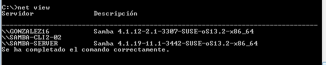

Samba - OpenSUSE

Para empezar con los preparativos he asignado los nombres a las máquinas como se pide en la práctica.

En la maquina server he añadidos los nombres de las maquinas con sus IP en el archivo hosts.

Utilizando yast he creado los usuarios y grupos.En la captura se puede ver los usuarios añadidos a los grupos.

Ahora modifico el fichero /etc/passwd para que el usuarios smbguest no pueda iniciar sesión ene l sistema.

Captura del grupo starwars con sus usuarios.

En esta captura estoy creando y  asignando los permisos a los recursos public.d,corusant.d,tatooine.d.

En este caso no ha hecho falta instalar samba, ya estaba instalado.Antes de modificar el fichero smb.conf creo una copia de seguridad.

He utilizado en un principio yast para configurar samba pero posteriormente he utilizado el archivo de configuración smb.conf.

Captura del fichero smb.conf

Seleccionando los recursos a compartir.

Lista de usuarios Samba utilizando el comando  pdbedit -L

Captura de los comandos  testparm netstat -tap

Ahora desde el cliente windows puedo acceder a los recursos compartidos por samba como si se tratará de recursos compartidos por una máquina windows

Captura del la ayuda del comando net use

resultados, desde el servidor Samba

Con el comando net view, vemos las máquinas (con recursos CIFS) accesibles por la red.

Conectando desde la máquina Windows al servidor Samba usando los comandos net

Comprobación desde el servidor

Ahora desde el cliente suse lo primero es ponernos en el mismo grupo de trabajo.

Para acceder a los recursos compartidos utilizo smb://dirección del servidor/recurso.

Al entrar en la carpeta corusant me pide el usuario y la contraseña.

Cptura que me muestra un error al intentar crear una algo en la carpeta public

Comprobación desde el servidor

smbclient --list ip-servidor-samba   (Muestra los recursos SMB/CIFS de un equipo concreto)

Captura creando el directorio en mnt y utilizando el comando mount para montar un recurso de forma manual y comprobando que está montado con el comando  df -hT

Comprobación desde el servidor

Editando el fichero fstab para que el montaje de la carpeta public se haga de forma automática.

Comprobación con el comando  df -hT que mmuestra despues de reiniciar la máquina como el recurso corusant 
montado manualmente ha desaparecido pero el recurso public se ha montado de forma automática

**Preguntas para resolver**

    ¿Las claves de los usuarios en GNU/Linux deben ser las mismas que las que usa Samba?

Si, es necesario crear primero los usuarios y añadirlos a samba server.

    ¿Puedo definir un usuario en Samba llamado sith3, y que no exista como usuario del sistema?

no, es necesario que este definido en el sistema.

    ¿Cómo podemos hacer que los usuarios sith1 y sith2 no puedan acceder al sistema pero sí al samba? (Consultar /etc/passwd)

Modificando el fichero /etc/passwd de la siguiente manera: "USUARIO: x :1001:1001:,,,:/home/USUARIO:/bin/false".

    Añadir el recurso [homes] al fichero smb.conf según los apuntes. ¿Qué efecto tiene?
Samba compartirá la carpeta home.

