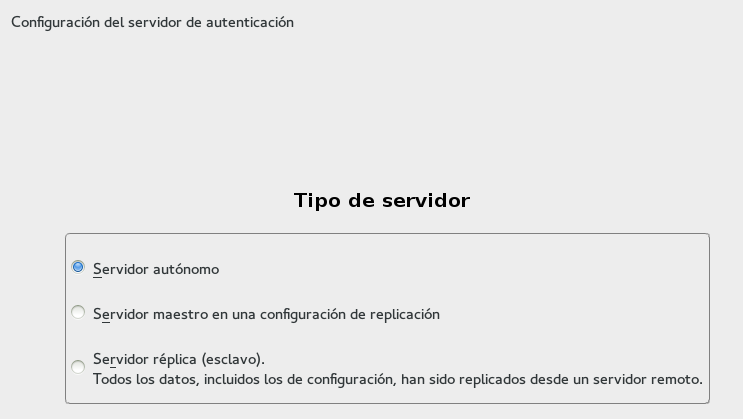

#Servidor LDAP - OpenSUSE

##1.1 Preparar la máquina
Comenzamos la instalación del servidor LDAP:
* Vamos a usar una MV para montar nuestro servidor LDAP con:
    * SO OpenSUSE 13.2
    * Instalar servidor SSH.
    * IP estática del servidor 172.18.XX.51 (Donde XX es su número de puesto).
    * Nombre equipo: `ldap-serverXX`
    * Dominio: `curso1516`
    * Además en `/etc/hosts` añadiremos:
```
127.0.0.2   ldap-serverXX.curso1516   ldap-serverXX
127.0.0.3   nombrealumnoXX.curso1516  nombrealumnoXX
```
Captura de configuración del archivo hosts


* Capturar imagen de la salida de los siguientes comandos: `ip a`, `hostname -f`, `lsblk`, `blkid`


##1.2 Instalación del Servidor LDAP
* Procedemos a la instalación del módulo Yast para gestionar el servidor LDAP (`yast2-auth-server`).
En Yast aparecerá como `Authentication Server`.
* Apartir de aquí seguimos los pasos indicados en [servidor LDAP](https://es.opensuse.org/Configurar_LDAP_usando_YaST)
de la siguiente forma:
   * Ir a Yast -> Servidor de autenticación.
   * Tipo de servidor: autónomo
   * Configuración TLS: NO habilitar
   * Usar como DN el siguiente: `dc=nombredealumnoXX, dc=curso1516`. Donde XX es el número del puesto de cada uno.
   * NO habilitar kerberos.
 
En este caso he instalado tanto el servidor como el cliente.  


Capturas de configuración servidor:




* Una vez instalado, comprobar el servicio `systemctl  status slapd`. 

Captura comprobando que el servicio está iniciado.


 
* Continuar los pasos del enlace hasta el final, donde se puede comprobar el contenido de la base de datos LDAP usando la herramienta `gq`. Esta herramienta es un browser LDAP.
* Comprobar que ya tenemos las unidades organizativas: `groups` y `people`.

Captura instalando y utilizando la herramienta GQ.


##1.3. Crear usuarios y grupos en LDAP
Ahora vamos a [introducir datos de usuarios y grupos](https://es.opensuse.org/Ingreso_de_usuarios_y_grupos_en_LDAP_usando_YaST)
en el servidor LDAP siguiendo los pasos indicados en el enlace.
forma:
Utilizo el **"Administrador de Usuarios y Grupos y selecciono en filtro LDAP"**,me ha pedido la contraseña de administrador que definimos en la configuración del servidor LDAP.

En esta captura muestro los grupos creados con sus usuarios.


* Debemos instalar el paquete `yast2-auth-client`, que nos ayudará a configurar la máquina para autenticación.
* En Yast aparecerá como `Authentication Client`.

Una vez abierto he creado un nuevo dominio ldap.


En esta captura se muestra definiendo la dirección de nuestro servidor LDAP.


##1.4. Autenticación
Con autenticacion LDAP prentendemos usar una máquina como servidor LDAP,
donde se guardará la información de grupos, usuarios, claves, etc. Y desde
otras máquinas conseguiremos autenticarnos (entrar al sistema) con los 
usuarios definidos no en la máquina local, sino en la máquina remota con
LDAP. Una especie de *Domain Controller*.

* Comprobar que podemos entrar (Inicio de sesión) en la MV `ldap-serverXX` usando los usuarios definidos en el LDAP.
* Capturar imagen de la salida de los siguientes comandos:

Con el comando **"cat /etc/passwd |grep nombre-usuario"** en este caso **"jedi21"** vemos que no encuentra nada ya que el usuario no existe en local.


Para conectarme con el usuario jedi21 he tenido que logearme como superusuario y utilizar el comando **"su jedi21"**.