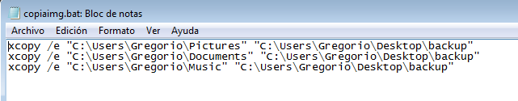

#Tareas programadas

##1.1 Configuración de la máquina
Capturar imágen de la configuración del equipo:

    uname -a     hostname -a    hostname -d    ip a    route -n    blkid

##1.2 Tarea diferida

* Hacer un ejemplo de tarea programada diferida (comando `at`). Por ejemplo ejecutar 
el apagado de la máquina con el comando `shutdown`.

##1.3 Tarea periódica

* Hacer un ejemplo de tarea programada periódica (crontab).

Captura del script añadir fecha.

Añadiendolo al archivo crontab.

y comprobando que funciona.

##1.4 Tarea asíncrona

* Hacer un ejemplo de tarea programada asíncrona. Elegir alguna tarea útil para la administración de sistema.
* Para definir una tarea asíncrona ponemos el script de ejecución en alguno 
de los directorios siguientes:
    * /etc/cron.hourly
    * /etc/cron.daily
    * /etc/cron.weekly
    * /etc/cron.monthly

He elegido el directorio * /etc/cron.monthly , he creado un script de backup que he encontrado en internet.

    
#2. Windows7

> En Windows 7 para iniciar el programador de tareas hacemos 
`Panel de control -> Herramientas administrativas -> Programador de tareas`.

##2.1 Configuración de la máquina

Capturar imágenes de las configuraciones.

##2.2 Tarea diferida
* Hacer un ejemplo de tarea programada diferida para ordenar el apagado de la máquina. 

> Para ver la ayuda del comando shutdown hacemos "shutdown /?". 
> Programar un apagado usando "shutdown /s".

He creado un script para apagar el pc, ese script hago que se ejecute con una tarea programada a una hora establecida 10:00.

Aquí estoy seleccionando el script.

##2.3 Tarea periódica
* Hacer un ejemplo de tarea programada periódica de mostrar mensaje a pantalla.

En este se ejecutará siempre que el usuario inicie sesión.Reinicio el pc y me muestra el mensaje.

##2.4 Tarea asíncrona
* Hacer un ejemplo de tarea programada asíncrona elegida por el usuario.

He creado un script para copiar ciertas carpetas  al directorio backup.

En esta captura configuro que se ejecute lo antes posible y en caso de que la máquina esté apagada que lo vuelva a intentar.

Desencadenador

