##1.1 Configuración

> En OpenSUSE podemos hacer configurar el equipo a través de `Yast`

Vamos a usar 3 MV's con las siguientes configuraciones:
* MV1 - master: Dará las órdenes de instalación/configuración a los clientes.

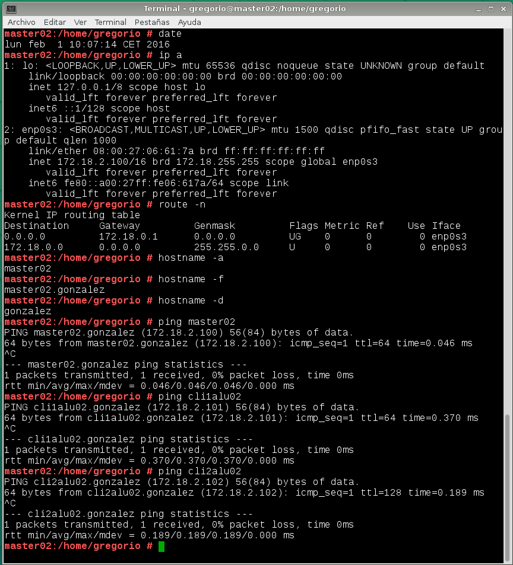

* MV1 - client1: recibe órdenes del master.

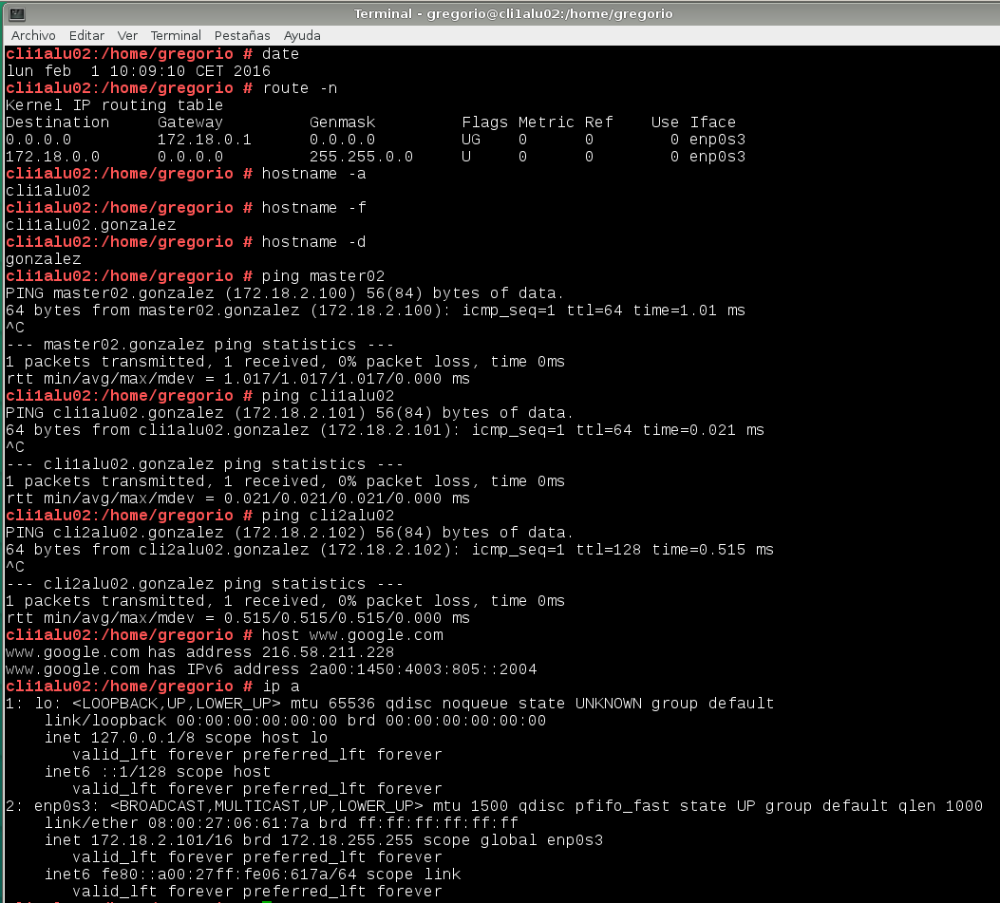

* MV3 - client2: recibe órdenes del master.

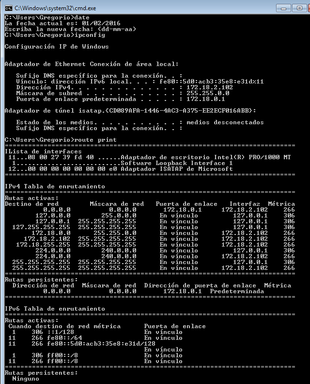

* Cada MV debe tener configurada en su `/etc/hosts` al resto. Para poder hacer `ping`
entre ellas usando los nombres. Con esto obtenemos resolución de nombres para nuestras
propias MV's sin tener un servidor DNS. 

Adjunto capturas de comprobación con el comando ping.

> **GNU/Linux**

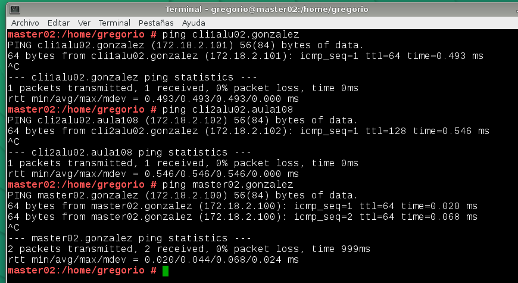

En Windows comprobamos con:

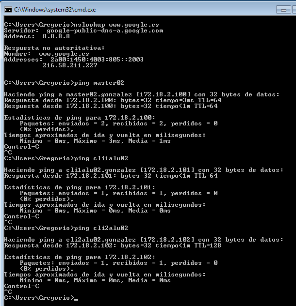

#2. Primera versión del fichero pp
* Preparamos los ficheros/directorios en el master:
```
    mkdir /etc/puppet/files

    mkdir /etc/puppet/manifests

    mkdir /etc/puppet/manifests/classes

    touch /etc/puppet/files/readme.txt

    touch /etc/puppet/manifests/site.pp

    touch /etc/puppet/manifests/classes/hostlinux1.pp
```
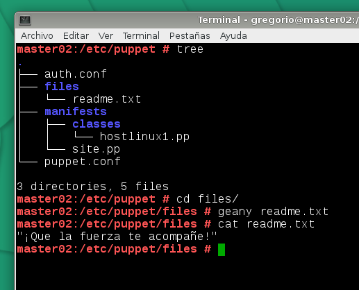

##2.2 /etc/puppet/manifests/site.pp

* `/etc/puppet/manifests/site.pp` es el fichero principal de configuración 
de órdenes para los agentes/nodos puppet.
* Contenido de nuestro `site.pp`:
```
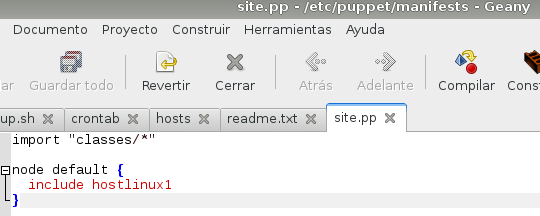

```
> Esta configuración significa:
> * Todos los ficheros de configuración del directorio classes se añadirán a este fichero.
> * Todos los nodos/clientes van a usar la configuración `hostlinux1`

##2.3 /etc/puppet/manifests/classes/hostlinux1.pp

Como podemos tener muchas configuraciones, vamos a separarlas en distintos ficheros para
organizarnos mejor, y las vamos a guardar en la ruta `/etc/puppet/manifests/classes`

*Vamos a crear una primera configuración para máquina estándar GNU/Linux.
* Contenido para `/etc/puppet/manifiests/classes/hostlinux1.pp`:
```
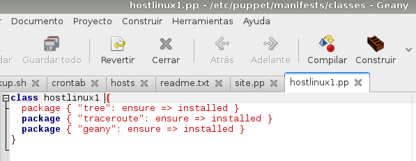

He cambiado los programas por *NANO,TREE,TRACEROUTE
```
* Comprobamos que el servicio está en ejecución de forma correcta.

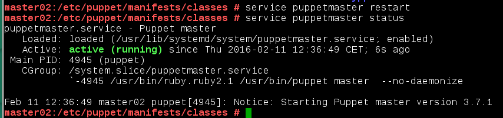

* Abrir el cortafuegos para el servicio.

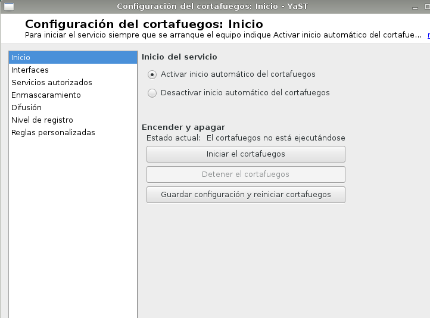

#3. Instalación y configuración del cliente1

Instalación:
* Instalamos Agente Puppet en el cliente:

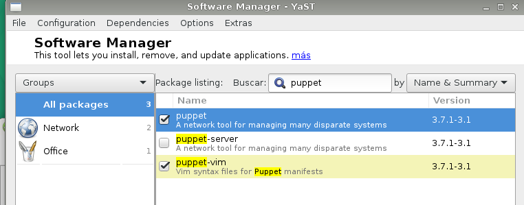

* El cliente puppet debe ser informado de quien será su master. 
Para ello, añadimos a `/etc/puppet/puppet.conf`:

```
    [main]
    server=masterXX.primer-apellido-alumno

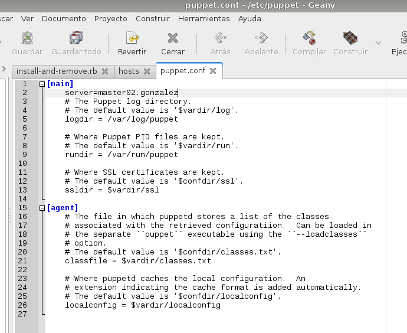

```
* Comprobar que tenemos los permisos adecuados en la ruta `/var/lib/puppet`.


* `systemctl status puppet`: Ver el estado del servicio puppet.

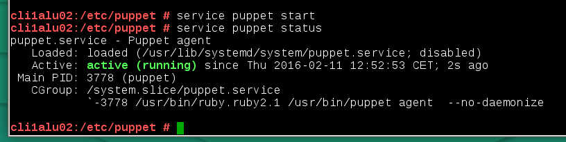

#4. Certificados

Antes de que el master acepte a cliente1 como cliente, se deben intercambiar los certificados entre 
ambas máquinas. Esto sólo hay que hacerlo una vez.

##4.1 Aceptar certificado

* Vamos al master y consultamos las peticiones pendiente de unión al master: `puppet cert list`
```
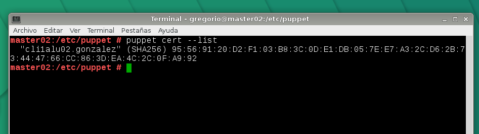

```

* Aceptar al nuevo cliente desde el master `puppet cert sign "nombre-máquina-cliente"`
```
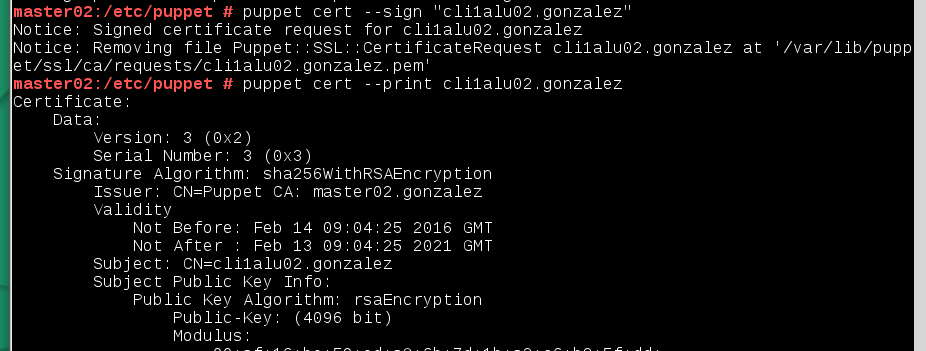

```
##4.2 Comprobación final

* Cliente1.

Capturas programas no instalados antes de ejecutar * `puppet agent --test`

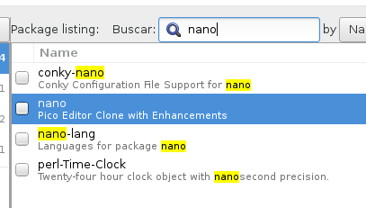
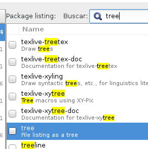
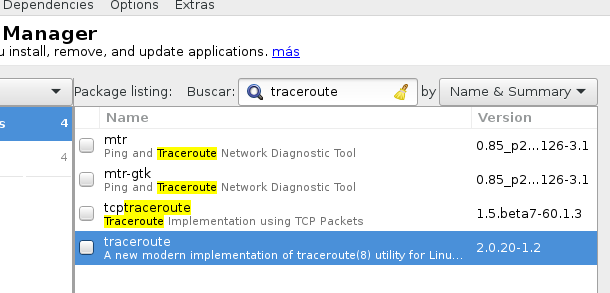

Instalación de programas al ejecutar * `puppet agent --test`

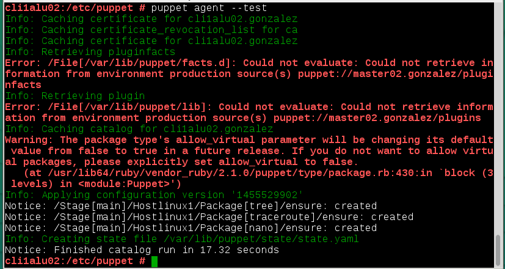

#5. Segunda versión del fichero pp

Ya hemos probado una configuración sencilla en PuppetMaster. 
Ahora vamos a pasar a configurar algo más complejo.

* Contenido para `/etc/puppet/manifests/classes/hostlinux2.pp`:

```
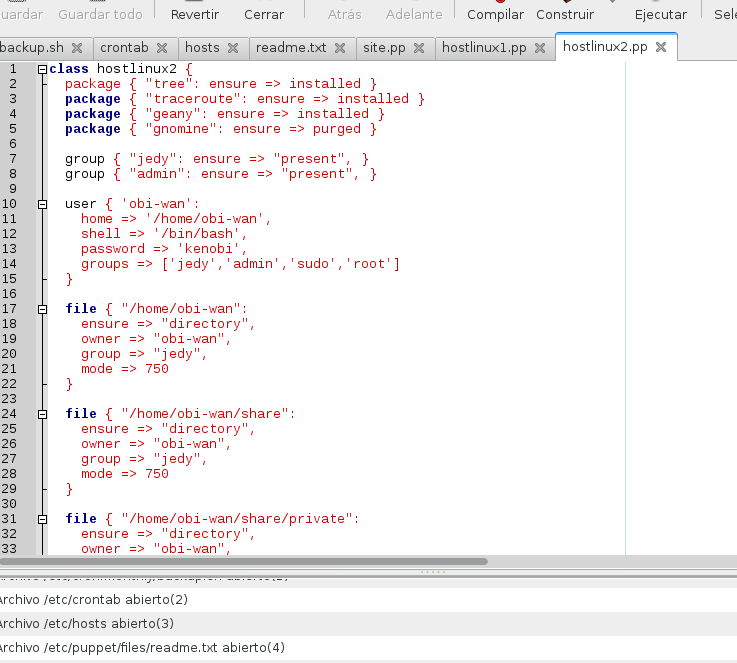

```
* Modificar `/etc/puppet/manifests/site.pp` con:

```
import "classes/*"

node default {
  include hostlinux2
}

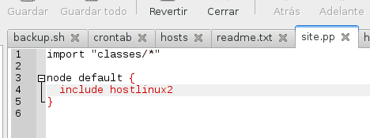
```
Comprobación.

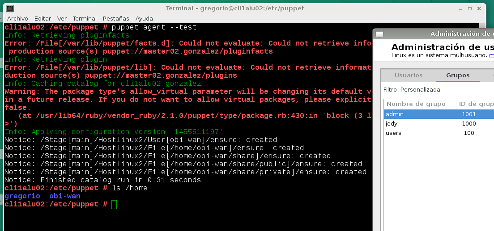

> Por defecto todos los nodos (máquinas clientes) van a coger la misma configuración.

#6. Cliente puppet windows

Vamos a configurar Puppet para atender también a clientes Windows.

Enlace de interés: 
* [http://docs.puppetlabs.com/windows/writing.html](http://docs.puppetlabs.com/windows/writing.html)

##6.1 Modificaciones en el Master

* En el master vamos a crear una configuración puppet para las máquinas windows, 
dentro del fichero `/etc/puppet/manifests/classes/hostwindows3.pp`, con el siguiente contenido:

```
class hostwindows3 {
  file {'C:\warning.txt':
    ensure => 'present',
    content => "Hola Mundo Puppet!",
  }
}

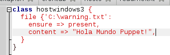

```

> De momento, esta configuración es muy básica. Al final la ampliaremos algo más.

* Ahora vamos a modificar el fichero `site.pp` del master, para que tenga en cuenta
la configuración de clientes GNU/Linux y clientes Windows, de la siguiente forma:

```
import "classes/*"

node 'cli1alu30.vargas' {
  include hostlinux2
}

node 'cli2alu30' {
  include hostwindows3
}

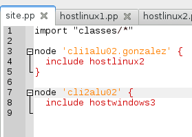
```

* Reiniciamos el servicio PuppetMaster.
* Ejecutamos el comando `facter`, para ver la versión de Puppet que está usando el master.

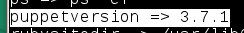

> Debemos instalar la misma versión de puppet en master y clientes


Aquí le indico el master.

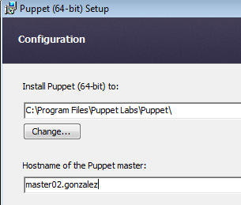

##6.2 Modificaciones en el cliente2

* Debemos aceptar el certificado en el master para este nuevo cliente. Consultar apartado 4.

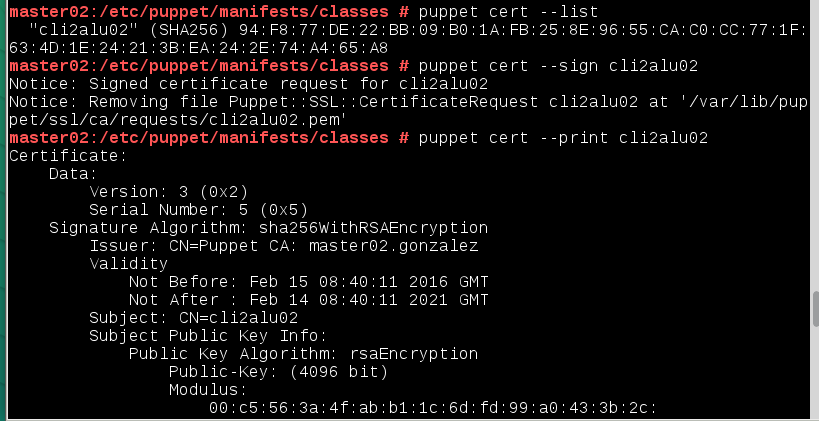

> Con los comandos siguentes podremos hacernos una idea de como terminar de configurar 
el fichero puppet del master para la máquina Windows.

* Iniciar consola puppet como administrador y probar los comandos: 

    * `puppet agent --server master02.gonzalez --test`: Comprobar el estado del agente puppet.

Veamos imagen:

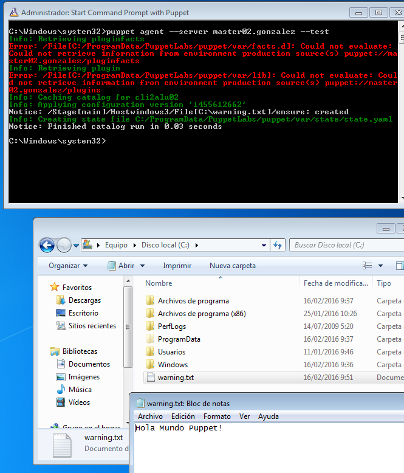

* Configuración en el master del fichero `/etc/puppet/manifests/classes/hostwindows3.pp` 
para el cliente Windows:

```
class hostwindows3 {
  user { 'darth-sidius':
    ensure => 'present',
    groups => ['Administradores']
  }

  user { 'darth-maul':
    ensure => 'present',
    groups => ['Usuarios']
  }
}

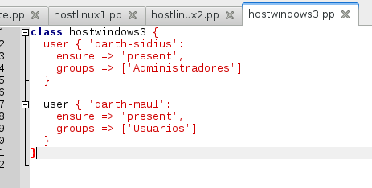
```
Comprobación

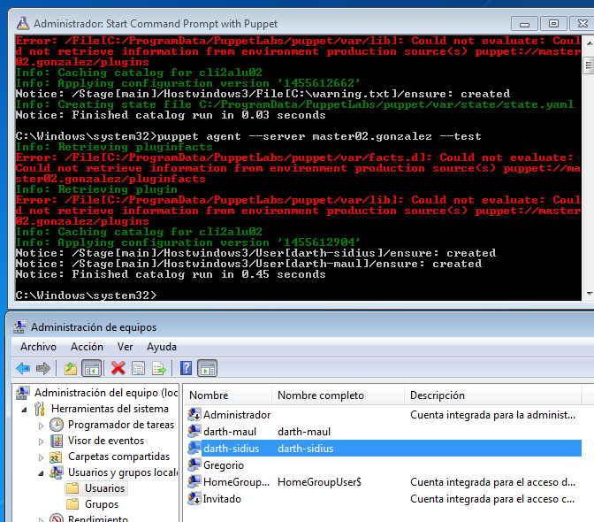

* Crear un nuevo fichero de configuración para la máquina cliente Windows.
Nombrar el fichero con `/etc/puppet/manifests/classes/hostwindows4.pp`.
Incluir configuraciones elegidas por el alumno.

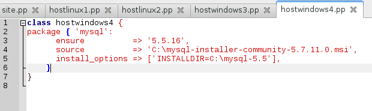

