# Escritorio Remoto con VNC

De las aplicaciones nombradas en la práctica hemos utilizado RealVNC. Descargamos la última versión de la pagina oficial.Instalamos servidor y visor como se muestra en la captura.
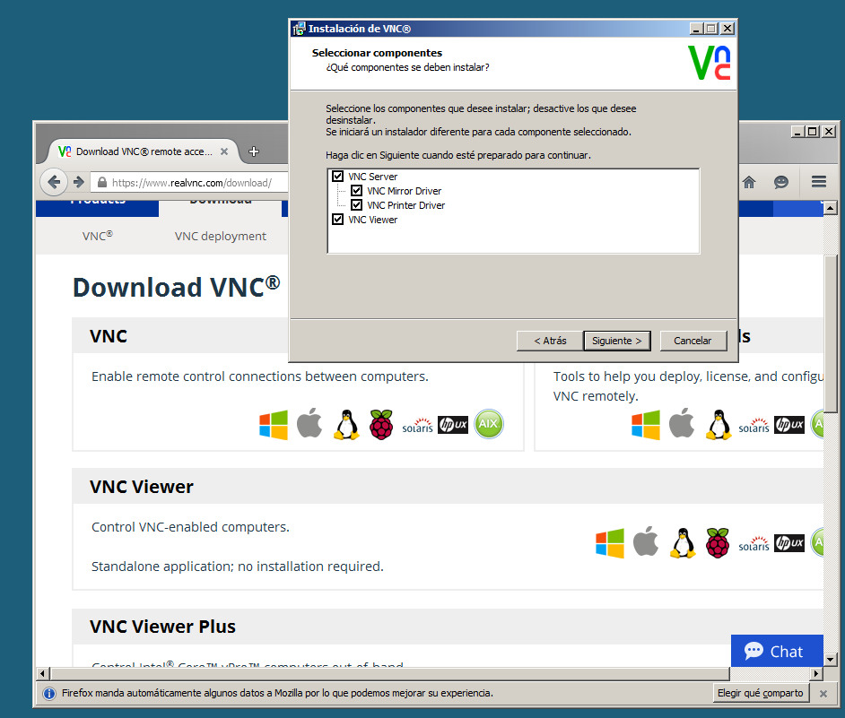

En esta captura puede verse el servicio activo del VNC
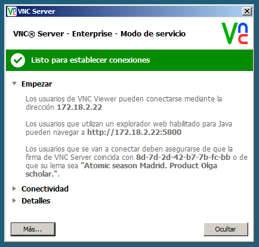

El siguiente paso será instalar solamente el visor en el cliente Windows 7.
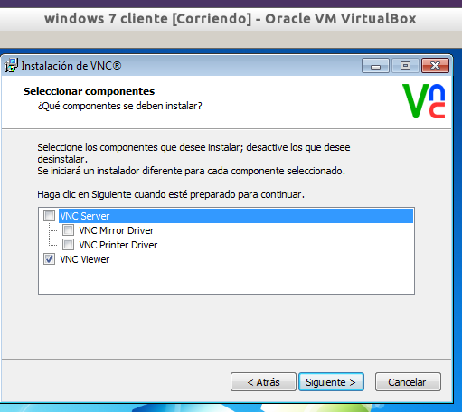

Para poder conectarse del cliente al servidor es necesario definir un usuario en el "server VNC".
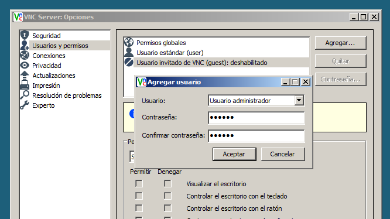

##Capturas probando las conexiones remotas VNC

### Conexión de Windows 7 a Windows Server
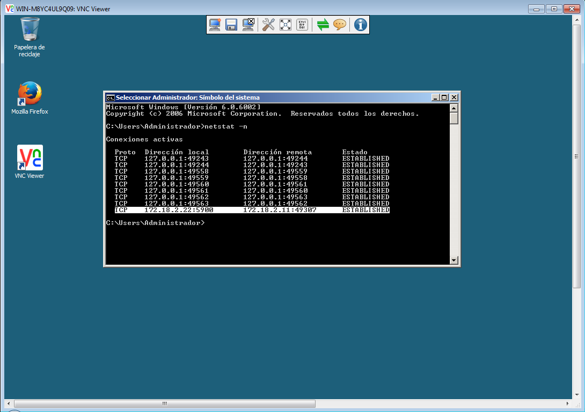

### Conexión de Debian a Windows Server
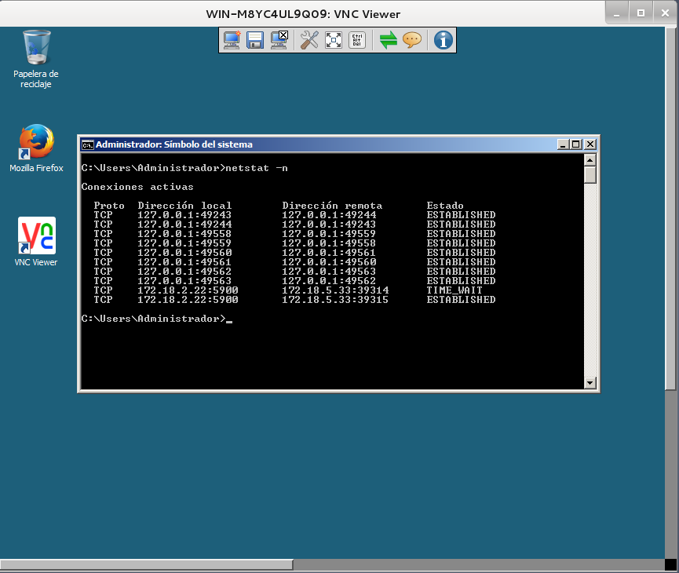

### Conexión de Debian a Debian
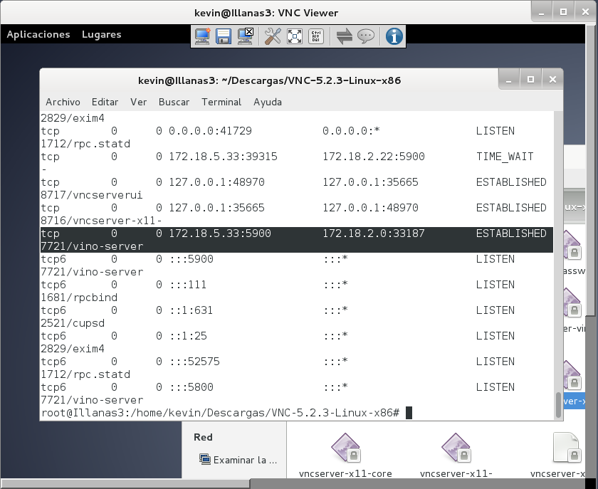

### Conexión de Windows 7 a Debian

# Escritorio Remoto RDP

Podemos ver en esta captura la configuración escritorio remoto y agregamos usuarios para que puedan conectarse.
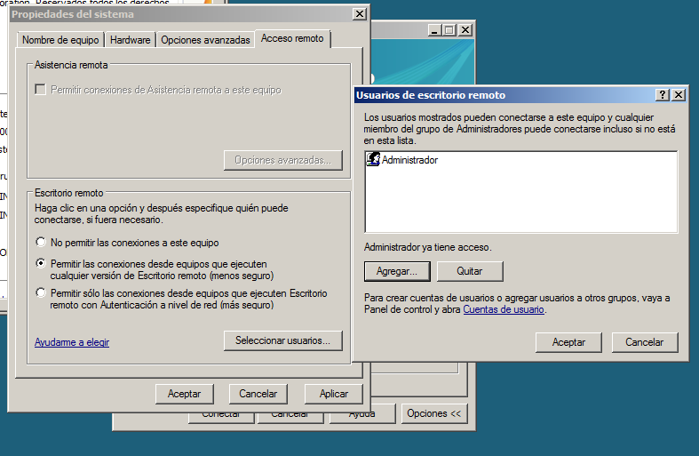

### Conexión con Escritorio Remoto de Windows 7 a Windows Server
Utilizando la conexión de escritorio remoto,en equipo introducimos la ip de servidor, 172.18.2.22.
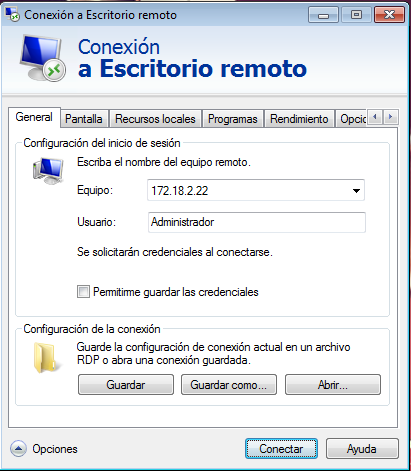
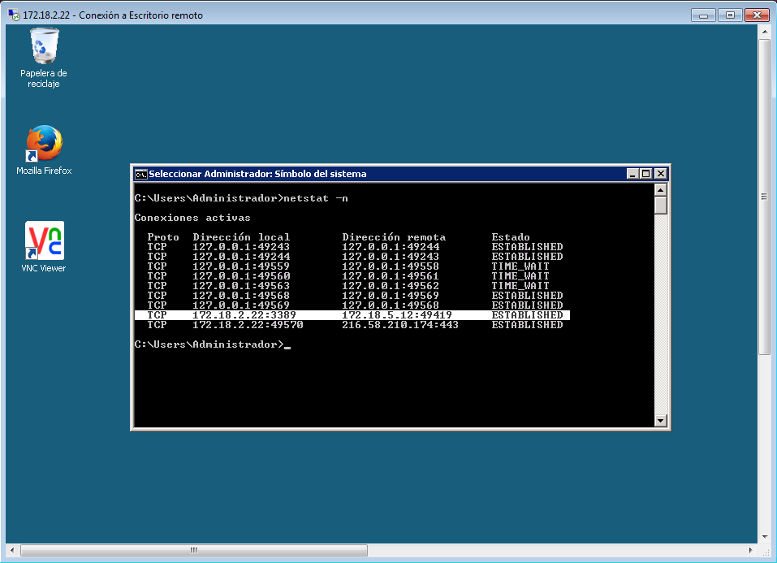

### Conexión con Vinagre de Debian a Windows Server
En este caso el paquete Vinagre ya venia instalado

Ahora abrimos el visor de escritorios remotos de Debian e introducimos al igual que en windows la ip del servidor 172.18.2.22.
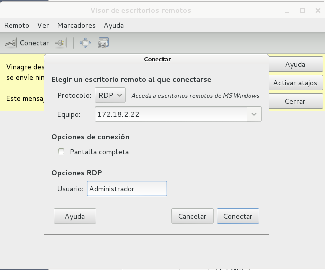
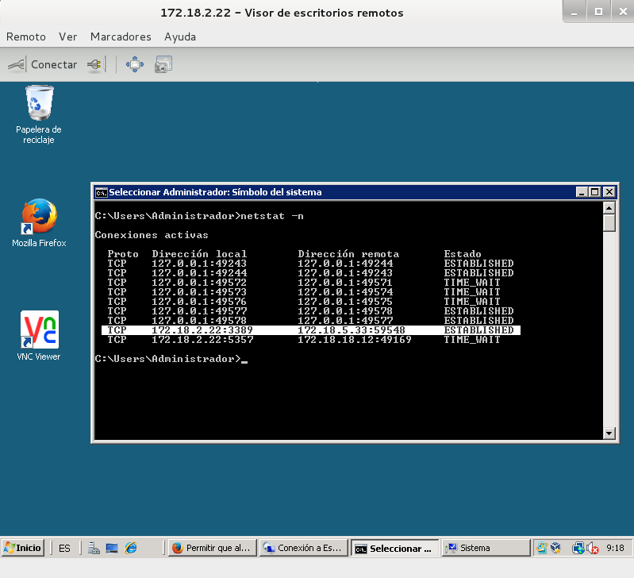

### Conexión con Vinagre de Windows 7 a Debian
Antes de establecer la conexión, hemos instalado en Debian el xrdp. En el momento de establecer la conexión se muestra la ventana de login de xrdp.
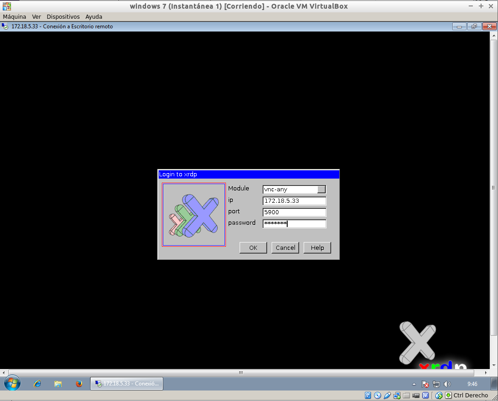
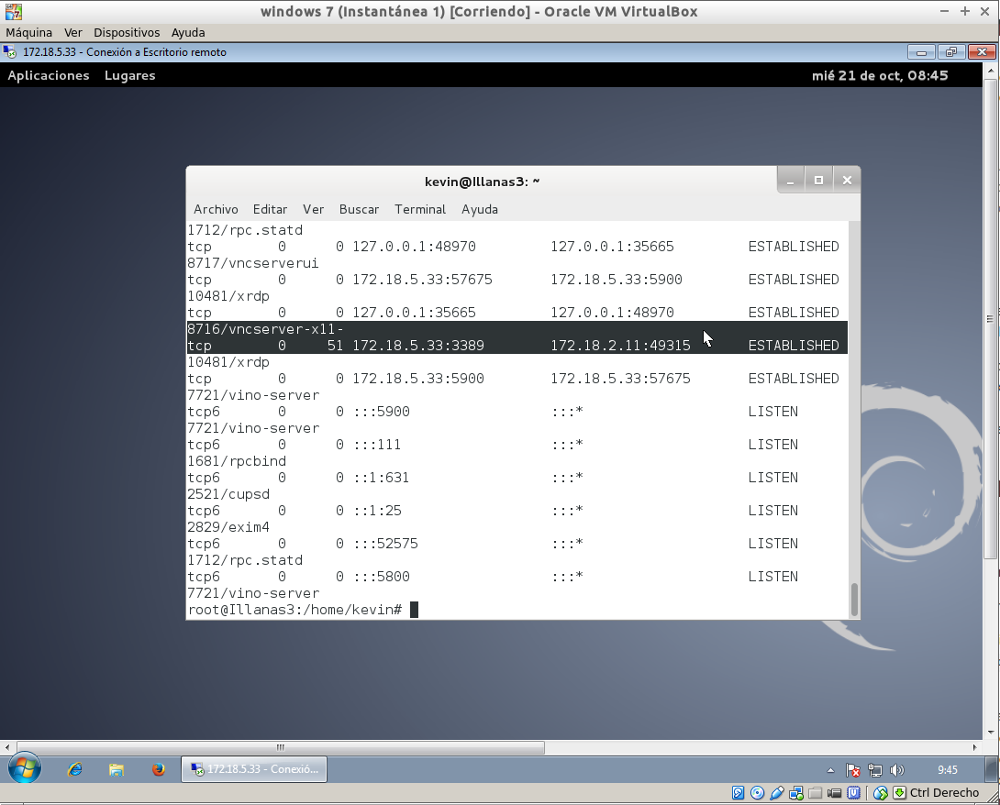

# Servidor de Terminales

Comenzamos instalando en el Windows Server la función de Terminal Services.
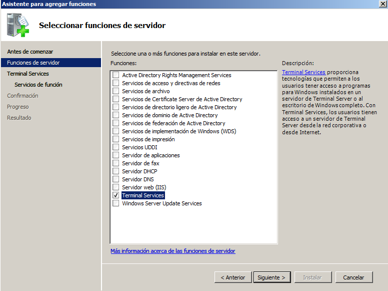

En el momento de instalación del Terminal Server hemos agregado el grupo de administradores y un usuario creado, "clienteremoto"

La siguiente captura mostramos como es posible tener establecidas más de una conexión simultáneamente de forma remota al Windows Server gracias al TS.
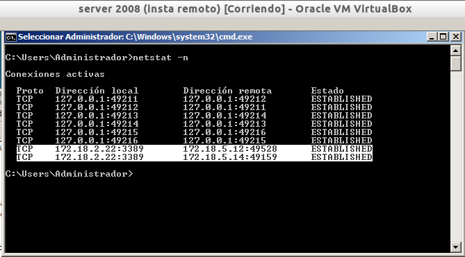

# RemoteApps

Para acceder a la configuración de RemoteAPP, vamos a herramientas administrativas y dentro de terminal services se encuentra el administrador de RemoteAPP de TS.
Para el primer paso, instalamos el Mozilla Firefox en el Windows Server y hemos generado y compartido el archivo .rdp con los clientes.Este archivo lo generamos desde la ventana de configuración de RemoteAPP.
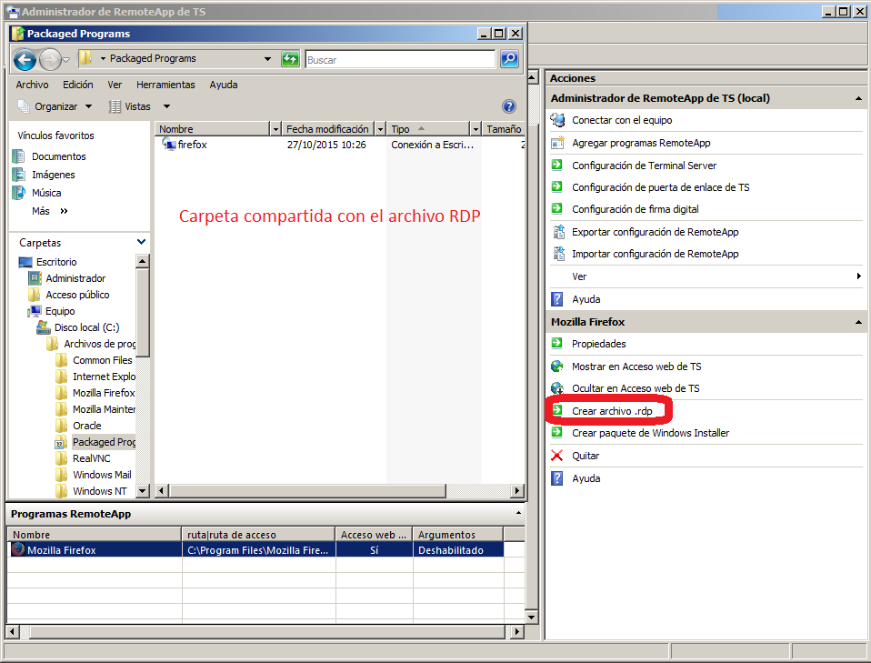
Ejecutando el archivo rdp desde otro equipo.
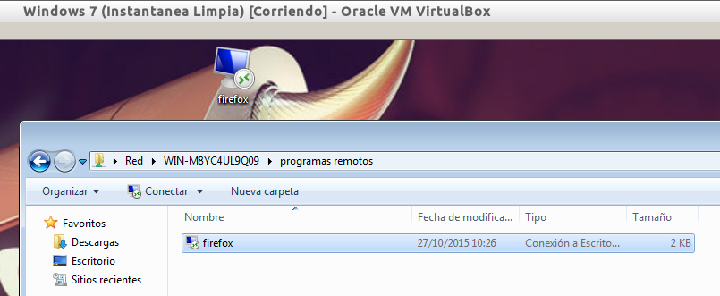
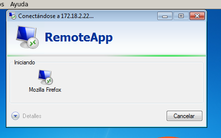
Vemos como la aplicación se inicia y mantiene el aspecto visual de de windows server.
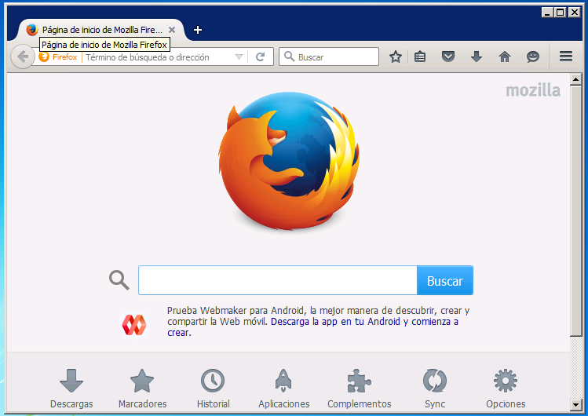